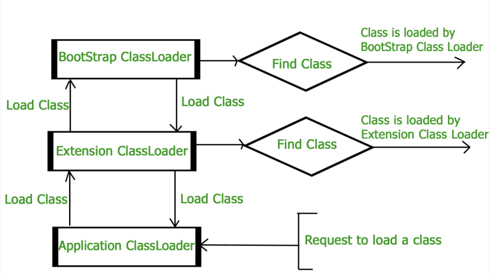

# Features that are introduced in Java 13
## 1. Dynamic CDS Archives
 

Since every class in Java must be loaded into JVM before initialisation, depending
on the type of class and the path of class, a particular class loader that loads 
the particular class is decided. For example, Java basic classes(Java.*, Javax.*) are
loaded by Bootstrap class loader.

Class Data sharing was introduced in JDK 5, however, it can only be used on Bootstrap 
classloader. In JDK 10, it was extended by adding application CDS(AppCDS), to give
developers the power to include application classes in the shared archive.

However, the process of archiving application classes was tedious. To generate archive 
files, developers had to do trial runs of their applications to create a class list first,
and then dump it into an archive. After that, this archive could be used to share 
metadata between JVMs. With dynamic archiving, JDK 13 has simplified this process. Now a 
shared archive can be generated at the time the application is exiting. This has eliminated 
the need for trial runs.

## 2. ZGC: Uncommit Unused Memory
The Z Garbage Collector was introduced in Java 11 as a low-latency garbage collection 
mechanism, such that GC pause times never exceeded 10 ms. However, unlike other HotSpot VM GCs 
such as G1 and Shenandoah, it was not equipped to return unused heap memory to the operating 
system. Java 13 added this capability to the ZGC.

## 3. Reimplement the legacy Socket API
Java 13 replaced old Socket API to new version. Java 13 replaces the underlying implementation 
to align the API with the futuristic user-mode threads. Instead of PlainSocketImpl, the provider 
interface now points to NioSocketImpl. This newly coded implementation is based on the same 
internal infrastructure as java.nio. The user still can optional choose old implementation though.
